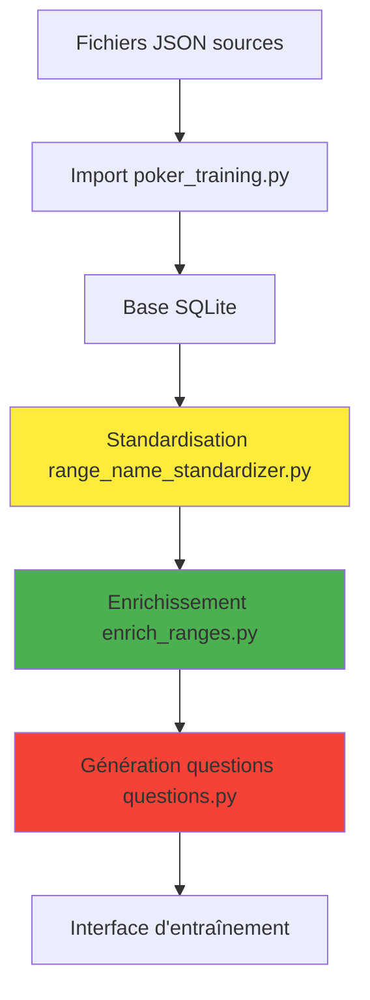

# Poker Training

Interface web locale pour travailler des ranges au poker.

## Vue d'ensemble

Le projet **poker-training** est une interface web locale permettant de travailler et d'entraîner des ranges de poker. Les ranges sont créées en format JSON via l'outil externe [Poker Range Editor](https://site2wouf.fr/poker-range-editor.php) puis importées dans l'application pour l'entraînement.

## Architecture du projet

```
poker-training/
├── data/
│   ├── poker_trainer.db          # Base SQLite principale
│   └── ranges/                   # Répertoire des fichiers JSON
│       ├── 5_Max-defense_BB_vs_steal.json
│       ├── 5 Max-défense BB vs steal.json
│       └── [autres fichiers ranges...]
├── web/
│   ├── app.py                    # Serveur Flask principal
│   └── templates/
│       ├── dashboard.html        # Page d'accueil avec stats
│       ├── import.html           # Interface d'import
│       ├── enrich.html          # Interface d'enrichissement
│       └── template.html        # Template de base
├── poker_training.py             # Script d'import des ranges
├── enrich_ranges.py              # Script d'enrichissement métadonnées
├── questions.py                  # Système de génération de questions
├── debug-validation.py           # Outils de debug
├── range_name_standardizer.py    # Standardisation noms de ranges
├── valid_system.py               # Validation système
└── test.py                       # Tests
```

## Composants principaux

### 1. Interface Web (Flask)
- **Serveur**: `web/app.py`
- **URL locale**: http://localhost:5000
- **Pages**:
  - Dashboard: Statistiques temps réel
  - Import: Import automatique des ranges JSON
  - Enrichissement: Gestion des métadonnées

### 2. Système d'import modulaire (`poker_training.py`)

**Architecture en couches**:
- **Models**: Structures de données (RangeFile, RangeContext, Range, RangeHand)
- **Database**: Repository pattern avec interface abstraite et implémentation SQLite
- **Parsers**: Factory pattern pour différents formats de fichiers
- **Import**: Script principal avec détection des changements (hash MD5)

**Fonctionnalités**:
- Import automatique depuis `data/ranges/`
- Détection des fichiers modifiés (pas de réimport inutile)
- Parsing intelligent des noms de contexte
- Extraction automatique des métadonnées (positions, actions)
- Gestion des erreurs et logs détaillés

**Parsers supportés**:
- `JSONRangeParser`: Fichiers JSON de l'éditeur de ranges
- Architecture extensible pour d'autres formats (GTO+, PIOSolver)

### 3. Base de données SQLite (`data/poker_trainer.db`)

**Structure normalisée**:
```sql
range_files          # Fichiers importés avec hash et timestamps
├── range_contexts   # Contextes de jeu (ex: "Défense BB vs UTG")
    ├── ranges       # Ranges individuelles (ex: "Call", "3Bet")
        └── range_hands  # Mains avec fréquences (ex: "AKo": 1.0)
```

**Index optimisés**:
- `idx_range_hands_range_id`: Requêtes par range
- `idx_range_hands_hand`: Recherche par main

### 5. Système de standardisation (`range_name_standardizer.py`)

**Objectif critique**: Normaliser les noms pour une génération de questions fiable.

**Fonctionnalités**:
- Standardisation des noms de contextes et ranges
- Validation des positions selon le format de table (5max, 6max, 9max, heads-up)
- Détection intelligente des actions (call, fold, 3bet_value, 3bet_bluff, etc.)
- Correction automatique des positions invalides (ex: MP en 5max → CO)
- Mise à jour des fichiers JSON sources avec backup automatique

**Actions détectées**:
```
Primaires: call, fold, 3bet_value, 3bet_bluff, 4bet_value, 4bet_bluff
Spéciales: squeeze_value, squeeze_bluff, open_raise, defense
Support: check, shove, limp
```

**Validation positionnelle**:
```
5max: UTG, CO, BTN, SB, BB
6max: UTG, MP, CO, BTN, SB, BB  
9max: UTG, UTG1, MP, MP1, LJ, HJ, CO, BTN, SB, BB
HU: BTN, BB
```

### 6. Système de génération de questions (`questions.py`)

**Objectif final**: Créer des questions d'entraînement basées sur les ranges et métadonnées enrichies.

**Pipeline de données**:
```
Fichiers JSON → Import → Standardisation → Enrichissement → Questions
```

## État actuel du projet

### ✅ Composants fonctionnels
- **Interface web Flask**: Dashboard, import, statistiques temps réel
- **Système d'import**: Parser JSON modulaire avec détection de changements
- **Base SQLite**: 5 tables avec relations et index optimisés
- **Import de 15 contextes** avec succès
- **Architecture modulaire**: Repository pattern, Factory pattern
- **Analyse automatique**: Extraction de métadonnées (positions, actions)

### 🔄 En développement
- **Système d'enrichissement V4**: Interface console fonctionnelle, intégration web en cours
- **Standardisation des noms**: Script fonctionnel mais bugs dans la mise à jour JSON
- **Génération de questions**: Pipeline défini, implémentation en cours

### 🚧 Composants avec problèmes identifiés

#### Problèmes d'encodage UTF-8 (`enrich_ranges.py`)
- 180+ caractères mal encodés (é, ðŸƒ, ✅, etc.)
- Impact sur l'affichage des caractères français et emojis
- Solution: Nettoyage systématique dans `clean_encoding_issues()`

#### Standardiseur de noms (`range_name_standardizer.py`)
- **Problème critique**: Déforme certains fichiers JSON lors des backups
- Fonctionnalités correctes: détection actions, validation positions
- **Impact**: Risque de corruption des données sources
- **Priorité**: Correction avant intégration web

#### Fichier JSON corrompu
- 1 fichier avec corruption externe identifiée
- N'affecte pas le fonctionnement global du système

### ❌ Fonctionnalités manquantes
- Interface web pour l'enrichissement des métadonnées  
- Interface web pour la standardisation des noms
- Système de génération de questions web
- Tests automatisés pour validation des composants

## Workflow de traitement des données



**Légende**: 🟡 Bugs identifiés | 🟢 Fonctionnel | 🔴 En développement

## Formats de données

### Format JSON d'entrée
Structure des fichiers générés par [l'éditeur de ranges](https://site2wouf.fr/poker-range-editor.php):

```json
{
  "data": {
    "ranges": {
      "1": { "name": "Call", "color": "#4CAF50" },
      "2": { "name": "3Bet", "color": "#F44336" },
      "3": { "name": "Fold", "color": "#9E9E9E" }
    },
    "values": {
      "AKo": [1, 2],    // AKo dans Call et 3Bet
      "AQs": [1],       // AQs dans Call seulement
      "72o": [3]        // 72o dans Fold
    }
  }
}
```

### Métadonnées extraites automatiquement

Le système analyse les noms de contexte pour extraire:

- **Positions**: UTG, UTG+1, MP, MP+1, LJ, HJ, CO, BTN, SB, BB
- **Actions**: open, call, 3bet, 4bet, fold, defense
- **Structure**: détection automatique des situations "vs"

**Exemples d'analyse**:
```
"5 Max-défense BB vs UTG"     → hero: BB, vs: UTG, action: defense
"CO Open 100bb"              → hero: CO, action: open
"3Bet vs BTN steal"           → action: 3bet, vs: BTN
```

**Score de confiance**: 0.0 à 1.0 selon la précision de l'analyse automatique

## Installation et démarrage

### Prérequis
```bash
# Environnement Python 3.8+
python3 -m venv mon_env
source mon_env/bin/activate

# Dépendances
pip install flask sqlite3 pathlib
```

### Démarrage rapide
```bash
# 1. Import initial des ranges
python poker_training.py

# 2. Lancer l'interface web
cd web/
python app.py

# 3. Accéder à l'interface
# http://localhost:5000
```

## Utilisation

### Workflow complet

1. **Créer des ranges**
   - Utiliser l'[éditeur en ligne](https://site2wouf.fr/poker-range-editor.php)
   - Sauvegarder en JSON avec un nom descriptif
   - Ex: `5 Max-défense BB vs UTG.json`

2. **Importer**
   ```bash
   # Placer les fichiers dans data/ranges/
   cp mes_ranges/*.json data/ranges/
   
   # Import automatique
   python poker_training.py
   ```

3. **Vérifier l'import**
   - Dashboard web: statistiques et aperçu
   - Logs détaillés avec confiance automatique
   - Détection des fichiers modifiés

4. **Enrichir** (optionnel)
   - Interface console: `python enrich_ranges.py`
   - Enrichissement des métadonnées
   - Génération de noms d'affichage

5. **S'entraîner**
   - Système de questions (en développement)
   - Basé sur les métadonnées enrichies

## Prochaines priorités

### 1. 🚨 Priorité CRITIQUE - Correction du standardiseur
**Problème**: `range_name_standardizer.py` déforme les fichiers JSON sources
**Impact**: Risque de perte de données
**Actions**:
- Corriger la fonction `_update_json_files()`
- Améliorer la validation des backups
- Tests exhaustifs avant mise en production

### 2. 🔧 Correction encodage UTF-8
**Problème**: Caractères corrompus dans `enrich_ranges.py`
**Actions**:
- Nettoyer systématiquement les 180+ caractères mal encodés
- Standardiser l'encoding sur tout le projet
- Valider l'affichage des caractères français

### 3. 🌐 Intégration web des outils console
**Objectif**: Rendre tous les outils accessibles via l'interface web
**Composants à intégrer**:
- Enrichissement des métadonnées (V4)
- Standardisation des noms
- Génération de questions

### 4. 🎯 Développement système de questions
**Pipeline complet**:
```
JSON → Import → Standardisation → Enrichissement → Questions → Entraînement
```


